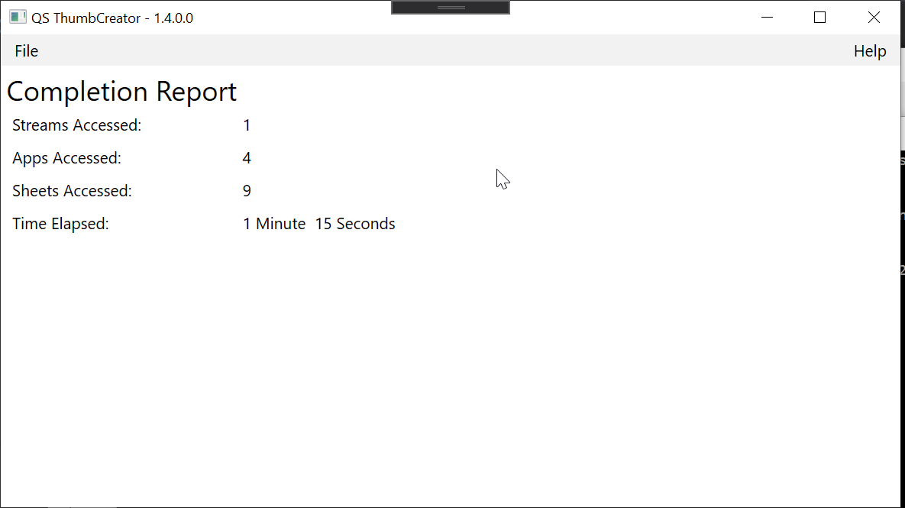

# QSThumbCreator
A WPF/C# app used to automate thumbnail creation for QlikSense

## Prerequisites
- The application as of now is only compatible with **Chrome 83**
- A valid QliKSense login will be required to interface with the QRS REST API

## How To Use

1. [Download release 1.4.0.0](https://qsthumbcreator.s3.amazonaws.com/releases/QSThumbCreator+1.4.0.0.zip)
2. Unzip the file
3. Run the .exe file named QSThumbCreator.exe
4. Input your credentials.
     
5. Select the apps you want to create thumbnails for
     
6. Choose whether you want to create images only, or push them to a content directory
     
7. If you chose to push to a content directory, select the directory here
     
8. Check the list of apps and hit the Go button
     
9. When the application is complete, a report will be generated
    
    
 
## To-Do
 -  [ ] Set the thumbnail for an app derived from it''s first sheet
 -  [ ] Set the thumbnail on the sheet itself

 &nbsp;&nbsp;&nbsp;&nbsp;&nbsp;&nbsp;Both To-Dos, I believe require the usage of the QlikEngine API which seems to be strangely documented

## Incorporated Libraries of Note

- [AutoItX.Dotnet](https://www.nuget.org/packages/AutoItX.Dotnet/)
- [ModernWpf](https://github.com/Kinnara/ModernWpf)
- [qlik_rest_sdk](https://github.com/kolsrud/qlik_rest_sdk)
- [Selenium WebDriver](https://www.selenium.dev/)
- [Selenium WebDriver ChromeDriver](https://github.com/jsakamoto/nupkg-selenium-webdriver-chromedriver/)

## License

MIT